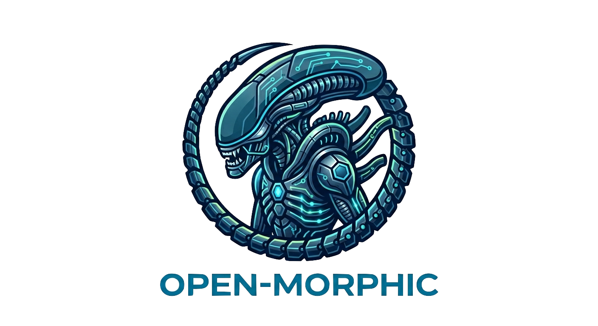

<div align="center">
  

  # Open-Morphic

  **Self-Evolving AI Agent Framework** — Mission Control for Intelligence

  [](./docs)
  [](./LICENSE)
  [](https://www.python.org/downloads/)
  [](https://github.com/engkimo/open-morphic/stargazers)
  [](https://github.com/engkimo/open-morphic/commits/main)
  [](https://github.com/engkimo/open-morphic/graphs/contributors)
</div>

Morphic-Agent orchestrates multiple AI engines (Claude Code, Gemini CLI, OpenHands, Codex CLI, Ollama) as a meta-orchestrator, combining them with a Unified Cognitive Layer for shared memory, task handoff, and self-evolution.

## Key Features

- **Multi-Engine Orchestration** — 6 agent runtimes (Ollama, Claude Code, Gemini CLI, o4-mini, OpenHands, Codex CLI) with automatic task routing
- **Fractal Task Engine** — Recursive DAG decomposition with quality gates and cost-aware planning
- **Unified Cognitive Layer** — Shared memory across all engines (L1-L4 hierarchy), conflict detection, agent affinity scoring
- **Self-Evolution** — Learning from execution history, error patterns, prompt template improvement
- **LOCAL_FIRST** — Ollama ($0) preferred; cloud models used only when needed
- **Interactive Planning** — Propose → Approve → Execute with per-node cost control
- **MCP + A2A** — Model Context Protocol tool integration + Google A2A agent-to-agent communication
- **Production Ready** — Docker, nginx reverse proxy, PG+pgvector+Redis+Neo4j, Chrome Extension

## Architecture

```
POST /api/tasks
  → IntentAnalyzer → ModelPreferenceExtractor → CollaborationMode
    → ArtifactDependencyResolver → LangGraphTaskEngine
      → Engine routing (Gemini CLI / Claude Code / Codex CLI / Ollama / OpenHands)
      → ReactExecutor fallback → Direct LLM fallback
    → Discussion Phase → Validation → InsightExtractor → Learning
```

4-layer Clean Architecture: **Domain** (zero deps) → **Application** (use cases) → **Infrastructure** (drivers) → **Interface** (API + CLI)

## Prerequisites

| Tool | Version | Required | Install |
|------|---------|----------|---------|
| Python | 3.12+ | Yes | `brew install python@3.12` |
| uv | latest | Yes | `curl -LsSf https://astral.sh/uv/install.sh \| sh` |
| Node.js | 22+ | For UI | `brew install node@22` |
| Docker | latest | Optional | `brew install --cask docker` |
| Ollama | latest | Recommended | `curl -fsSL https://ollama.ai/install.sh \| sh` |

## Setup (Step by Step)

### Step 1: Clone and install

```bash
git clone https://github.com/engkimo/open-morphic.git
cd open-morphic
uv sync --extra dev
```

### Step 2: Environment file

```bash
cp .env.example .env
```

Edit `.env` and add your API keys (all optional — Ollama alone works for $0):

```bash
# At minimum, set one of these for cloud model access:
ANTHROPIC_API_KEY=sk-ant-...      # Claude (recommended)
OPENAI_API_KEY=sk-...             # GPT-4o / o4-mini
GOOGLE_GEMINI_API_KEY=...         # Gemini
```

Validate your config:

```bash
python scripts/validate_env.py
```

### Step 3: Start Ollama (free local LLM)

```bash
ollama serve                  # Start Ollama daemon (if not already running)
ollama pull qwen3:8b          # Download default model (~4.7GB)
```

### Step 4: Choose database mode

**Option A: In-Memory (simplest, no Docker needed)**

No extra setup. This is the default when `USE_POSTGRES=false` and `USE_SQLITE=false`.
Data is lost on restart.

**Option B: SQLite (persistent, no Docker needed)**

Add to `.env`:
```bash
USE_SQLITE=true
```

**Option C: PostgreSQL + Redis + Neo4j (full stack)**

```bash
docker compose up -d
```

Add to `.env`:
```bash
USE_POSTGRES=true
```

### Step 5: Start the API server

```bash
make serve
# or: uv run uvicorn interface.api.main:app --host 0.0.0.0 --port 8001 --reload
```

Verify: open http://localhost:8001/api/health — should return `{"status": "ok"}`

### Step 6: Start the frontend (optional)

```bash
cd ui
npm install
npm run dev
```

Open http://localhost:3000

### Step 7: Verify system health

```bash
uv run morphic doctor check
```

This checks Ollama, CLI tools, Docker, engines, API keys, and database connectivity.

## Engine Setup (Optional)

Morphic-Agent can route tasks to specialized AI engines. All are optional.

### Ollama (default, $0)

Already set up in Step 3. Verify:
```bash
ollama list
```

### Claude Code CLI

```bash
npm install -g @anthropic-ai/claude-code
claude --version
```

Requires `ANTHROPIC_API_KEY` in `.env`.

### Gemini CLI

```bash
npm install -g @anthropic-ai/claude-code   # already installed above
npx @anthropic-ai/claude-code              # or install gemini separately
gemini --version
```

Requires `GOOGLE_GEMINI_API_KEY` in `.env`.

### OpenAI Codex CLI

```bash
npm install -g @openai/codex
codex login                   # Opens browser for OpenAI authentication
codex exec "print('hello')"  # Verify
```

Requires `OPENAI_API_KEY` in `.env`.

### OpenHands (Docker sandbox)

```bash
docker run -d --name openhands \
  -p 3000:3000 \
  -v /var/run/docker.sock:/var/run/docker.sock \
  -e LLM_API_KEY=$ANTHROPIC_API_KEY \
  -e LLM_MODEL=claude-sonnet-4-6 \
  ghcr.io/all-hands-ai/openhands:latest
```

## Dev Commands

```bash
make test-unit        # 2,943 unit tests
make test-integration # 148 integration tests
make lint             # Ruff linter
make serve            # FastAPI dev server (port 8001)
make ui-dev           # Next.js dev server (port 3000)
make docker-prod      # Full production stack (nginx + api + ui + pg + redis + neo4j)
make clean            # Remove __pycache__ and .pytest_cache
```

## CLI

```bash
morphic task run "Implement feature X"    # Execute a task
morphic plan list                         # List execution plans
morphic engine status                     # Check engine availability
morphic cost summary                      # View cost breakdown
morphic doctor check                      # System health check
morphic serve start                       # Start API server
```

17 command groups: task, plan, model, cost, mcp, engine, fallback, learning, marketplace, memory, context, evolution, cognitive, benchmark, a2a, doctor, serve

## API Endpoints

| Method | Path | Description |
|--------|------|-------------|
| POST | `/api/tasks` | Create and execute a task |
| GET | `/api/tasks` | List all tasks |
| GET | `/api/plans` | List execution plans |
| GET | `/api/cost` | Cost summary |
| GET | `/api/engines` | Engine status |
| GET | `/api/models/status` | Ollama model status |
| GET | `/api/settings` | Runtime configuration |
| GET | `/api/settings/health` | System health check |
| GET | `/api/memory/search?q=...` | Semantic memory search |
| WS | `/ws/tasks/{id}` | Real-time task updates |

## Chrome Extension (Context Bridge)

Export Morphic-Agent context to any AI platform (Claude Code, ChatGPT, Cursor, Gemini) via clipboard.

### Install (Developer Mode)

1. Open Chrome → `chrome://extensions/`
2. Enable **Developer mode** (top-right toggle)
3. Click **Load unpacked** → select `ui/extension/` folder
4. Pin the extension from the toolbar puzzle icon

### Usage

- Click the extension icon (or `Ctrl+Shift+M` / `MacCtrl+Shift+M`)
- Select target platform and optional topic
- Click **Export Context** → content is formatted for the target AI
- Click **Copy to Clipboard** → paste into the target AI

The extension connects to `http://localhost:8001` by default (configurable in Settings).

## Production Deployment

```bash
# Build and start full stack
docker compose -f docker-compose.prod.yml up -d --build

# Services: nginx (:80) → api (:8001) + ui (:3000) + pg + redis + neo4j
```

## Project Structure

```
morphic-agent/
├── domain/          # Layer 1: Pure business logic (zero external deps)
├── application/     # Layer 2: Use cases
├── infrastructure/  # Layer 3: Drivers, DB, LLM adapters
├── interface/       # Layer 4: FastAPI routes + CLI
│   ├── api/         #   REST API (12 route modules)
│   └── cli/         #   CLI (17 command groups)
├── shared/          # Cross-cutting (config, logging)
├── ui/              # Next.js 15 frontend (18 pages)
│   └── extension/   #   Chrome Extension (Context Bridge)
├── tests/           # 3,091 tests (unit + integration)
├── scripts/         # Utility scripts
└── migrations/      # Alembic (PostgreSQL)
```

## Tech Stack

| Layer | Technology |
|-------|-----------|
| Agent Framework | LangGraph |
| LLM Gateway | LiteLLM (100+ models) |
| Local LLM | Ollama |
| API | FastAPI + WebSocket |
| Database | PostgreSQL + pgvector, SQLite fallback, In-Memory default |
| Frontend | Next.js 15, React Flow |
| Protocols | MCP, Google A2A |
| CI/CD | GitHub Actions |

## License

[MIT](LICENSE)
