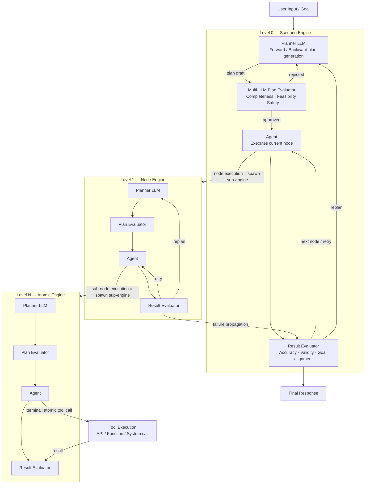
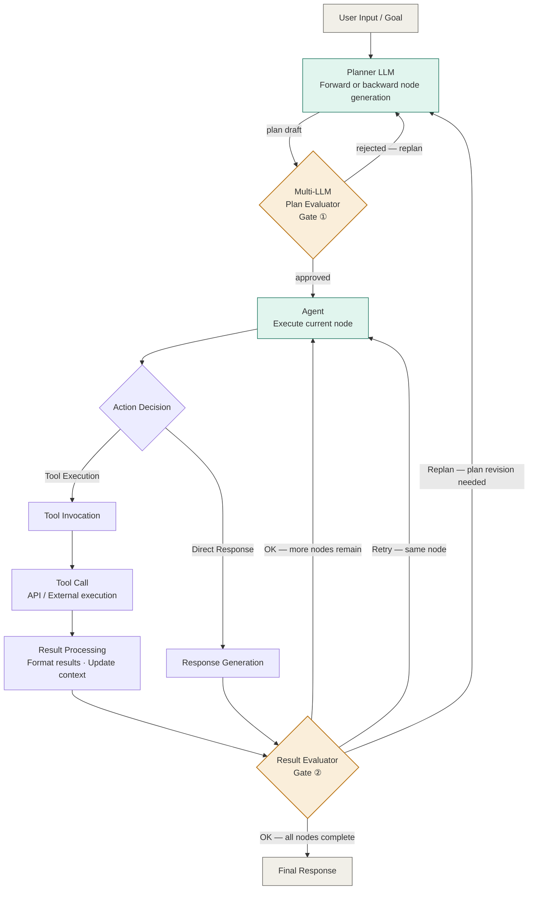
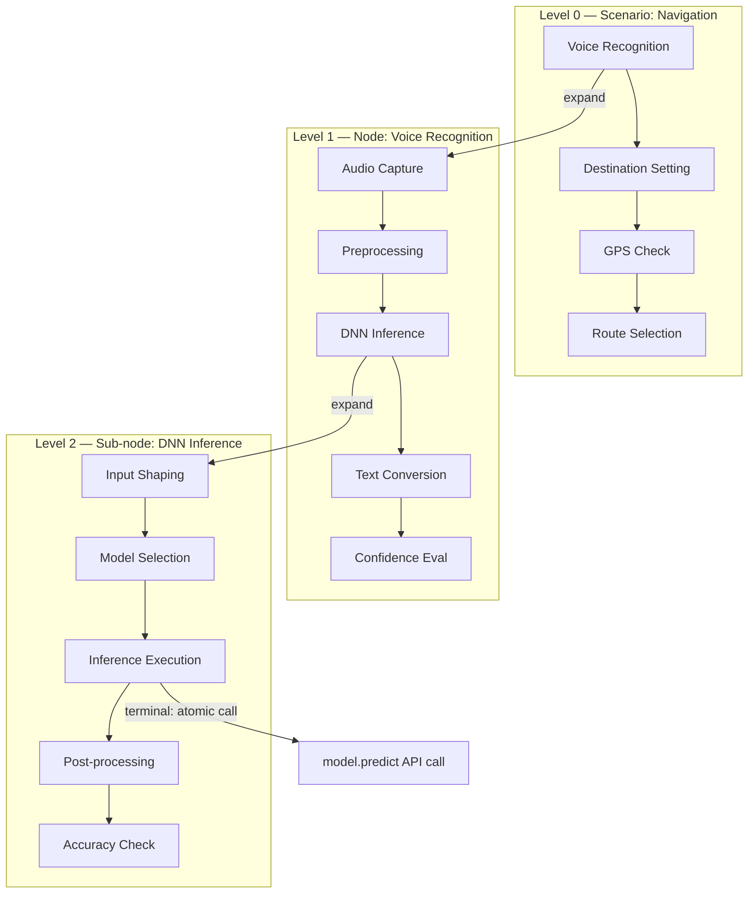
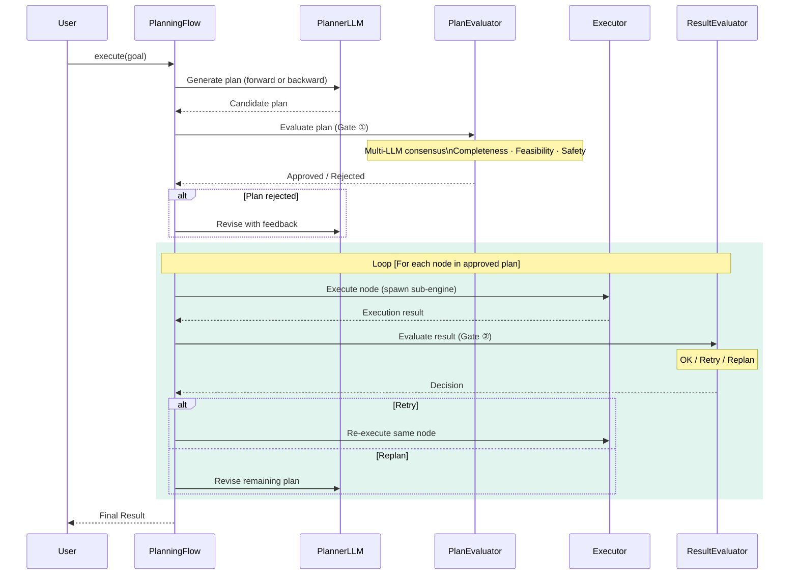
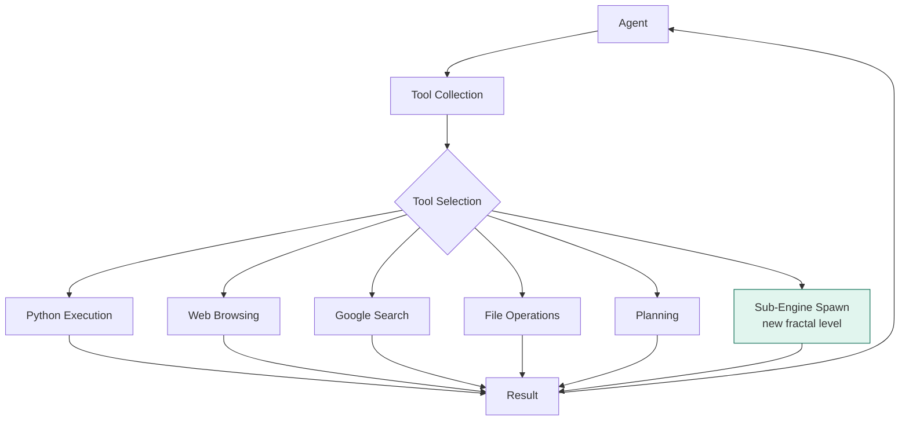

## Overview

an autonomous AI agent system built on a **fractal recursive engine architecture**. By simply setting a goal, the agent automatically plans and executes tasks, self-corrects through multi-layered evaluation gates, and continuously learns from experience to achieve objectives.

The system is grounded in a fundamental principle: **any node in an execution plan is itself an engine instance**. Each node — when expanded — runs the same Planner → Plan Evaluator → Agent → Result Evaluator loop internally. This recursive self-similarity enables handling of tasks at arbitrary depth and complexity.

A key insight is the **iceberg structure of execution plans**: what appears as a linear sequence of nodes (e.g., Voice Recognition → Destination Setting → GPS Check → Route Selection) is merely the visible surface. Beneath it, the engine generates a much larger candidate space at every transition point. Plan Evaluators prune unsuitable candidates before execution; Result Evaluators detect failures after execution; and a third category — conditionally held nodes — remains submerged until triggered by runtime conditions (e.g., GPS failure surfaces manual location setting and image-based positioning as alternatives).

This architecture generalizes completely: the same engine handles navigation scenarios, medical diagnosis flows, procurement workflows, customer support, or any goal-directed task domain without modification.

### Key Features

- **Fractal Recursive Engine**: Every execution node is an engine instance. Expanding any node reveals the same Planner → Plan Eval → Agent → Result Eval structure at a finer granularity. Nesting continues until atomic tool calls are reached.
- **Dual Evaluation Gates**: Two independent evaluation checkpoints — Gate ① (Multi-LLM Plan Evaluator before execution) and Gate ② (Result Evaluator after execution) — prevent both pre-execution planning errors and post-execution quality failures from propagating.
- **Iceberg Candidate Space**: At each node transition, the engine generates multiple candidate nodes. Plan Eval prunes pre-execution; Result Eval detects post-execution failures; conditional nodes remain in reserve and surface when runtime conditions change.
- **Failure Propagation**: Result Eval failures at level N bubble up to level N-1. Deep failures can propagate to the scenario level, triggering full replan.
- **Multi-LLM External Evaluation**: Plan evaluation uses multiple LLMs or evaluation personas (completeness checker, feasibility checker, risk checker) independent of the generating model, eliminating confirmation bias.
- **Self-Correcting Execution**: Detects errors during execution and attempts automatic correction at the appropriate nesting level.
- **Generalization**: The engine is domain-agnostic. Scenario knowledge lives only in the dynamically generated execution plan, not in the engine itself.
- **GraphRAG Learning**: Builds a knowledge graph of past error patterns, successful execution paths, and reusable modules for continuous improvement.
- **Knowledge Editing (ROME)**: Directly edits internal knowledge of language models to update facts.
- **Self-Reflective Reasoning (COAT)**: Implements Chain-of-Action-Thought for improved reasoning and self-correction.
- **Knowledge Graph Processing (R-GCN)**: Uses Relational Graph Convolutional Networks for sophisticated knowledge representation.
- **Isolated Execution Environments**: Each project runs in its own virtual environment to prevent dependency conflicts.
- **Multi-level API Fallback**: Sophisticated fallback mechanisms for web search and LLM APIs ensure continuous operation.

---

## Architecture and Design Philosophy

### Core Principle: Two Layers, One Engine

Morphic-Agent operates on a strict two-layer separation:

```
Layer 1 (Dynamic)  — Execution Plan
  [Node A] → [Node B] → [Node C] → ...
  Generated, modified, and pruned at runtime.
  Domain-specific. Changes with every scenario.

Layer 2 (Fixed)    — Universal Engine
  Planner → Plan Evaluator → Agent → Result Evaluator
  Domain-agnostic. Never changes.
  Runs identically for navigation, medical, procurement, etc.
```

**The engine creates the plan. The engine then executes each node in the plan. When executing a node, the engine creates a sub-plan for that node. This recursion continues until atomic operations are reached.**

---

### System Architecture Overview



---

### Iceberg Candidate Space

The visible execution plan is the surface of a much larger candidate space generated at each node transition.

```
Visible plan:  [Voice Recognition] → [Destination Setting] → [GPS Check] → [Route Selection]
                        ↑                      ↑                   ↑               ↑
                   ENGINE RUNS           ENGINE RUNS           ENGINE RUNS     ENGINE RUNS
                   generates N           generates N           generates N     generates N
                   candidates            candidates            candidates      candidates
                   prunes all            prunes all            holds 2 as      prunes all
                   but this one          but this one          conditional     but this one
```

**Three states of invisible nodes:**

| State | Trigger | Example |
|---|---|---|
| Plan Eval removed | Pruned before execution — judged unnecessary | Text input, gesture input, OCR input at Voice Recognition slot |
| Result Eval failed | Attempted execution, declared failure | Quantum annealing attempted but timed out → Dijkstra adopted |
| Conditionally held | Submerged until a condition fires | Manual location setting, image-based positioning (surface only on GPS failure) |

---

### Agent Execution System (Updated)

The core execution loop, now with both evaluation gates:



---

### Fractal Recursive Structure

Every node in an execution plan is itself an engine instance. Expanding any node reveals the identical engine structure at a finer granularity:



**Termination condition**: A node is terminal (not expanded) when the Plan Evaluator at that level judges that no further decomposition is required — i.e., the task maps directly to a single atomic tool call.

**Failure propagation**: A Result Eval failure at Level N reports to Level N-1. If Level N-1 cannot compensate within its sub-plan, it reports to Level N-2. This bubbles up until a level can absorb the failure via replanning, or until it surfaces to the scenario level.

---

### Planning Flow



---

### Tool Integration System



---

## Main Components

### 1. Engine Layer (Fixed — Domain-Agnostic)

| Component | Role |
|---|---|
| **Planner LLM** | Generates candidate node sequences. Supports forward generation (start→goal) and backward generation (goal→start). |
| **Multi-LLM Plan Evaluator** (Gate ①) | External evaluation of generated plans by multiple LLMs or personas. Axes: completeness, feasibility, safety. Approved plans proceed; rejected plans return to Planner with feedback. |
| **Agent** | Executes the current node. If the node requires decomposition, spawns a child engine at level N+1. If terminal, invokes atomic tool directly. |
| **Result Evaluator** (Gate ②) | Evaluates execution output against goal alignment, accuracy, and validity. Decides: OK (advance), Retry (re-execute same node), or Replan (return to Planner). |

### 2. Plan Layer (Dynamic — Domain-Specific)

| Component | Role |
|---|---|
| **Execution Plan** | The sequence of visible nodes generated by the Planner and approved by Gate ①. Changes at runtime through self-correction. |
| **Candidate Space** | All nodes generated but not adopted. Includes Plan Eval pruned, Result Eval failed, and conditionally held nodes. |
| **Conditional Nodes** | Submerged nodes held in reserve. Surface and become active when specific runtime conditions fire (e.g., GPS failure → location estimation node). |

### 3. Agent System
- **BaseAgent**: Base class for all agents. Carries `nesting_level` to track recursion depth and `spawn_sub_engine()` to instantiate child engines.
- **ToolCallAgent**: Agent with tool invocation capabilities.
- **AutoPlanAgent**: Agent capable of automatic planning, execution, and self-repair.

### 4. Flow System
- **BaseFlow**: Base class for flows.
- **PlanningFlow**: Manages planning and execution, coordinates both evaluation gates, and handles failure propagation across nesting levels.

### 5. Tool System
- **PlanningTool**, **PythonExecuteTool**, **PythonProjectExecuteTool**, **FileTool**, **DockerExecuteTool**, **SystemTool**

### 6. Learning System
- **GraphRAGManager**: Learns and retrieves error and code patterns via knowledge graph.
- **ModularCodeManager**: Manages reusable code modules extracted from successful tasks.
- **ROMEModelEditor**: Edits internal knowledge of language models.
- **COATReasoner**: Self-reflective reasoning chain implementation.
- **RGCNProcessor**: Knowledge graph processing via relational graph networks.

---

## Workflow

1. **Goal Input**: User inputs the goal.
2. **Plan Generation** (Planner LLM): Goal decomposed into candidate node sequence. Supports forward (start→goal) and backward (goal→start) generation.
3. **Plan Evaluation** (Gate ①): Multi-LLM evaluator assesses completeness, feasibility, and safety. Rejected plans are revised with feedback. Approved plans proceed.
4. **Node Execution** (Agent): For each node, Agent executes it. If the node requires sub-tasks, a child engine at level N+1 is spawned. If terminal, an atomic tool call is made directly.
5. **Result Evaluation** (Gate ②): Result Evaluator assesses each node's output. Decides OK, Retry, or Replan. Failures propagate upward through nesting levels if the current level cannot absorb them.
6. **Self-Correction**: Planner revises the remaining plan using evaluator feedback, activating conditionally held nodes as needed.
7. **Learning**: Successful execution paths, error patterns, and reusable modules are recorded in GraphRAG and the knowledge graph.
8. **Result Reporting**: Summary of execution results returned to user.

---

## Learning System

### GraphRAG Learning System
- **Error Pattern Learning**: Records encountered errors and successful fixes, including which candidate nodes failed and which alternatives succeeded.
- **Task Template Learning**: Accumulates successful sub-engine execution patterns per task type and nesting level.
- **Contextual Retrieval**: Enhances prompts using similar past resolutions.

### Module Reuse System
- **Module Extraction**: Extracts reusable code from successful atomic-level executions.
- **Dependency Management**: Maintains inter-module dependencies.
- **Contextual Application**: Automatically incorporates relevant modules into new tasks at the appropriate nesting level.

---

## Knowledge Graph Management

The system uses a knowledge graph for information representation. Managed by `RGCNProcessor`.

The knowledge graph now captures not only task patterns but also **plan structures and candidate pruning decisions**, enabling the Planner to learn which node candidates are typically pruned at each transition and why — directly improving future plan generation quality.

- **Auto-creation**: Graph auto-initializes if absent.
- **Compatibility Mode**: Auto-detects available libraries (DGL, PyTorch, NetworkX).
- **Persistent Storage**: All updates saved to disk automatically.

### Extending the Learning System

Add new search and storage methods to `GraphRAGManager`. Extend Weaviate schema for new data types.